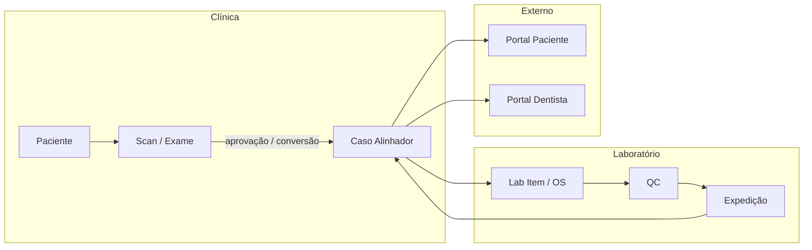

# Documento Mestre de Arquitetura e Contexto — Arrimo OrthoScan

> **Propósito:** Single Source of Truth (SSOT) para humanos e LLMs que implementam features no OrthoScan sem perder alinhamento com domínio, arquitetura e convenções do projeto.  
> **Produto empacotado:** `Lab. Orthoscan` (`com.orthoscan.lab`)  
> **Última análise do repositório:** 2026-05-24  
> **Escopo:** código em `src/`, `desktop/`, `supabase/`, `whatsapp-service/`, infra de deploy e testes.

---

## Índice

1. [Visão Geral do Sistema e Domínio](#1-visão-geral-do-sistema-e-domínio)
2. [Stack Tecnológica Oficial](#2-stack-tecnológica-oficial)
3. [Arquitetura e Topologia do Código](#3-arquitetura-e-topologia-do-código)
4. [Modelagem de Dados, Firebase, Supabase e Estado](#4-modelagem-de-dados-firebase-supabase-e-estado)
5. [Regras de Negócio, Fluxos e Integrações](#5-regras-de-negócio-fluxos-e-integrações)
6. [Diretrizes e Padrões para Evolução](#6-diretrizes-e-padrões-para-evolução)
7. [Regras Estritas para IAs](#7-regras-estritas-para-ias)
8. [Apêndices](#8-apêndices)

---

## 1. Visão Geral do Sistema e Domínio

### 1.1 Propósito central

O **Arrimo OrthoScan** é um sistema de gestão operacional para **clínicas odontológicas** e **laboratórios de ortodontia digital**, com foco em:

- Cadastro e relacionamento: **clínicas**, **dentistas**, **pacientes** e **usuários internos**
- **Escaneamentos** (exames/intraorais, fotos, RX, arquivos 3D) como ponto de entrada clínico
- **Casos de alinhadores** (planejamento, bandejas, aprovações, financeiro, entregas)
- **Pipeline de laboratório** (fila, produção, QC, expedição, reconfecções, SLA)
- **Portais externos** para pacientes e dentistas (acesso por link/magic link)
- Módulos complementares: **agenda**, **contratos/faturamento**, **estoque**, **políticas de preço**, **chat interno**, **notificações PWA**, **IA assistiva** (feature flags/jobs), **WhatsApp** (lembretes de troca de alinhador)

O produto é entregue como:

| Canal | Descrição |
| --- | --- |
| **SPA Web** | React + Vite, deploy Vercel/Docker/Nginx |
| **PWA** | `vite-plugin-pwa`, service worker customizado (`src/sw.js`) |
| **Desktop** | Electron (Windows/NSIS) empacotando `dist/` |

Não é um ERP genérico: o domínio é **ortodontia digital com alinhadores**, com vocabulário e estados específicos (scan → caso → lab → entrega → uso).

### 1.2 Personas e usuários finais (inferidos do código)

| Persona | Perfil RBAC (`Role`) | O que faz no sistema |
| --- | --- | --- |
| **Administrador master** | `master_admin` | Acesso total; configurações; reset de dados (policies restritas); visão cross-clínica |
| **Gestor / admin da clínica** | `dentist_admin` | Operação administrativa da clínica; cadastros; aprovações; sem exclusão de dentistas/clínicas em alguns casos |
| **Dentista externo (cliente)** | `dentist_client` | Portal e cadastro de pacientes vinculados ao dentista; scans e casos do seu escopo |
| **Clínica externa (cliente)** | `clinic_client` | Similar ao dentista, escopo por clínica; inclui permissões de IA comercial |
| **Técnico de laboratório** | `lab_tech` | Fila e produção lab; leitura de casos/scans |
| **Recepção** | `receptionist` | Agenda, pacientes, scans, casos (leitura), lab (leitura), IA clínica/comercial |
| **Paciente (externo)** | *(sem login Firebase/Supabase interno)* | Portal público: cronograma, fotos de progresso, documentos, magic link |
| **Dentista (portal externo)** | `dentist_client` em `/app/portal-dentista` ou rotas `/acesso/*` | Acompanhamento de casos, documentos, aprovações |

### 1.3 Fluxo de valor de ponta a ponta (resumo)



---

## 2. Stack Tecnológica Oficial

### 2.1 Versões principais (`package.json`)

| Pacote | Versão | Papel |
| --- | ---: | --- |
| `react` / `react-dom` | ^19.2.0 | UI |
| `react-router-dom` | ^7.13.0 | Roteamento SPA |
| `typescript` | ^5.9.3 | Tipagem estrita |
| `vite` | ^7.2.4 | Bundler e dev server |
| `@vitejs/plugin-react` | ^5.1.1 | Fast Refresh |
| `tailwindcss` | ^3.4.17 | Estilos utilitários |
| `firebase` | ^12.13.0 | Auth + Firestore + Storage (modo produção atual) |
| `@supabase/supabase-js` | ^2.95.3 | Backend alternativo / legado em migração |
| `electron` | ^40.6.1 | Shell desktop |
| `electron-builder` | ^26.8.1 | Instalador Windows NSIS |
| `vitest` | ^4.0.18 | Testes unitários |
| `@playwright/test` | ^1.58.2 | E2E |
| `vite-plugin-pwa` | ^1.2.0 | PWA |
| `posthog-js` | ^1.373.5 | Analytics |
| `exceljs` | ^4.4.0 | Exportações Excel |
| `sql.js` | ^1.14.0 | Persistência local estruturada (legado/demo) |
| `pg` | ^8.21.0 | Scripts/diagnósticos server-side |
| `firebase-admin` | ^13.10.0 | Operações privilegiadas (fora do bundle browser) |

### 2.2 Dependências secundárias críticas

| Pacote | Uso |
| --- | --- |
| `clsx` + `tailwind-merge` | Composição de classes (`src/lib/cn.ts`) |
| `lucide-react` | Ícones |
| `supabase` CLI (dev) | Migrations e Edge Functions |

**Não há** biblioteca de formulários global (React Hook Form / Formik): formulários são controlados com `useState` nos containers/páginas.

### 2.3 Infraestrutura adjacente

| Componente | Local |
| --- | --- |
| **Supabase** (Postgres + Auth + Storage + Edge Functions) | `supabase/` |
| **WhatsApp microservice** | `whatsapp-service/` (Node + `whatsapp-web.js`) |
| **CI** | `.github/workflows/ci.yml` — lint, typecheck, vitest, build (sem E2E no CI padrão) |
| **Deploy** | Vercel (`vercel.json`), Docker/Nginx, scripts blue/green em `scripts/` |
| **Monitoramento** | PostHog + Edge Function `frontend-monitoring` |

### 2.4 Variáveis de ambiente essenciais

Arquivo referência: `.env.example`

| Variável | Valores | Função |
| --- | --- | --- |
| `VITE_DATA_MODE` | `local` \| `firebase` \| `supabase`* | Seleciona provedor de dados/auth |
| `VITE_FIREBASE_*` | — | Config Firebase Web SDK |
| `VITE_SUPABASE_URL` / `VITE_SUPABASE_ANON_KEY` | — | Client Supabase |
| `VITE_STORAGE_PROVIDER` | `supabase` \| `microsoft_drive` | Destino de uploads |
| `VITE_WEB_PUSH_ENABLED` | `true` \| `false` | Push PWA |
| `VITE_INTERNAL_CHAT_ENABLED` | flag | Chat interno |
| `VITE_APP_URL` | URL pública | Links e redirects OAuth |
| `VITE_PUBLIC_POSTHOG_*` | — | Analytics |
| `ELECTRON_BUILD` | `1` | `base: './'` no Vite para Electron |

\* **Atenção:** o tipo `DataMode` inclui `'supabase'`, mas `src/data/dataMode.ts` hoje só resolve `local` e `firebase` (default `firebase`). Código em todo o repo assume `DATA_MODE === 'supabase'`. Para usar Supabase em produção, é necessário **corrigir o resolver** ou o modo nunca ativa. Ver [§4.1](#41-modos-de-dados-triplo-backend).

---

## 3. Arquitetura e Topologia do Código

### 3.1 Padrão de design

Combinação híbrida, evoluindo para **DDD leve por módulos**:

| Camada | Onde | Responsabilidade |
| --- | --- | --- |
| **Presentation** | `src/pages/`, `src/components/`, `src/modules/*/presentation/` | UI, hooks de tela, modais, seções |
| **Application** | `src/modules/*/application/` | Casos de uso (`useCases/`), portas (`ports/`) |
| **Domain** | `src/modules/*/domain/` | Entidades, value objects, serviços de domínio, eventos |
| **Infrastructure** | `src/modules/*/infra/`, `src/repo/`, `src/data/` | Firebase, Supabase, localStorage/SQL.js |
| **Shared** | `src/shared/` | Erros, validators, observability, utils |
| **Legado ativo** | `src/repo/`, `src/data/*Repo.ts` | Repositórios usados diretamente por páginas não modularizadas |

**Factory pattern** para repositórios por modo de dados:

- `createLabRepository(currentUser)` → Firebase \| Supabase \| Local
- `createCaseRepository(currentUser)` → Supabase \| Local *(Firebase usa `src/data/caseRepo.ts` nas páginas)*
- `createDashboardRepository`, `createPatientAccessRepository` — mesma ideia

**Não há** Redux/Zustand global: estado de tela em React hooks; sessão em `sessionStorage`; dados remotos via fetch pontual ou polling.

### 3.2 Árvore de diretórios principal

```text
orthoscan-1/
├── desktop/                 # Electron: main, preload, ícone, start-dev
├── dist/                    # Build Vite (gerado)
├── docs/                    # Documentação (este arquivo, runbooks)
├── e2e/                     # Playwright
├── public/                  # Assets estáticos, PWA, brand, notification.mp3
├── scripts/                 # QA, deploy, preflight, monitoring
├── src/
│   ├── main.tsx             # Bootstrap React + analytics + monitoring
│   ├── App.tsx              # Rotas, lazy pages, ToastProvider, PWA bridge
│   ├── index.css            # Tailwind + tokens de marca
│   ├── app/                 # ProtectedRoute, InternalRouteUrlMask, ToastProvider
│   ├── auth/                # authFirebase, authSupabase, authLocal, permissions, scope
│   ├── components/          # UI compartilhada (Card, Sidebar, Topbar, scans, lab…)
│   ├── data/                # Modo local: db.ts, *Repo.ts, seeds, sync
│   ├── diagnostics/         # runDiagnostics, testData
│   ├── lib/                 # Clients (firebase, supabase), auth, upload, whatsapp…
│   ├── mocks/               # photoSlots e fixtures
│   ├── modules/             # Contextos delimitados (ver §3.3)
│   ├── pages/               # Rotas de alto nível (thin wrappers → containers)
│   ├── pwa/                 # SW registration, push, notifications hook
│   ├── repo/                # Repositórios Supabase/Firebase transversais
│   ├── routes/              # Constantes de paths
│   ├── shared/              # application, domain, errors, validators, observability
│   ├── sw.js                # Service Worker (injectManifest PWA)
│   ├── tests/               # Vitest
│   └── types/               # Tipos de domínio legado (Case, Scan, User…)
├── supabase/
│   ├── migrations/          # 30 migrations SQL (schema + RLS)
│   └── functions/           # 16 Edge Functions Deno
├── whatsapp-service/        # Microsserviço de lembretes WhatsApp
├── package.json
├── vite.config.ts
├── tailwind.config.js
├── eslint.config.js
└── tsconfig.app.json
```

### 3.3 Módulos de negócio (`src/modules/`)

Cada módulo segue: `presentation` → `application` → `domain` → `infra`.

| Módulo | Responsabilidade | README |
| --- | --- | --- |
| `dashboard` | KPIs executivos, backlog, SLA gerencial | — |
| `cases` | Ciclo de vida do caso, timeline, planejamento, financeiro | `src/modules/cases/README.md` |
| `lab` | Pipeline laboratorial, fila, reconfecção, SLA | `src/modules/lab/README.md` |
| `publicAccess` | Portal paciente, magic link, upload fotos | — |
| `dentistPortal` | Visão externa do dentista | — |
| `notifications` | Notificações estratégicas | — |
| `agenda` | Eventos de escaneamento/planejamento | migration `0027_agenda_eventos` |

Páginas em `src/pages/` frequentemente importam **containers** de `modules/*/presentation/*PageContainer.tsx`.

### 3.4 Entrada, roteamento e layout

- **Bootstrap:** `src/main.tsx` → `App.tsx`
- **Router:** `BrowserRouter` em HTTP(S); **`HashRouter`** quando `window.location.protocol === 'file:'` (Electron)
- **Rotas internas:** prefixo `/app/*`, protegidas por `ProtectedRoute` + permissão (`src/auth/permissions.ts`)
- **Rotas públicas:** `/login`, `/acesso/*`, `/legal/*`, `/complete-signup`, `/reset-password`
- **Lazy loading:** todas as páginas via `React.lazy` + `Suspense`
- **Máscara de URL:** `InternalRouteUrlMask` — UX de URLs internas

Rotas principais (não exaustivo):

| Path | Permissão | Página |
| --- | --- | --- |
| `/app/dashboard` | `dashboard.read` | Dashboard executivo |
| `/app/agenda` | `agenda.read` | Agenda |
| `/app/scans` | `scans.read` | Escaneamentos |
| `/app/cases`, `/app/cases/:id` | `cases.read` | Casos / detalhe |
| `/app/lab` | `lab.read` | Laboratório |
| `/app/patients`, `.../:id` | `patients.read` | Pacientes |
| `/app/dentists`, `.../:id` | `dentists.read` | Dentistas |
| `/app/clinics`, `.../:id` | `clinics.read` | Clínicas |
| `/app/settings` | `settings.read` | Configurações |
| `/app/pricing`, `/app/inventory`, `/app/contracts` | `settings.read` | Comercial/estoque |
| `/app/portal-dentista` | `cases.read` | Portal dentista interno |
| `/acesso/pacientes/portal` | público | Portal paciente |

### 3.5 Electron: Main ↔ Renderer

**Arquitetura intencionalmente mínima** — quase toda a lógica vive no Renderer (React).

| Arquivo | Papel |
| --- | --- |
| `desktop/main.cjs` | Cria `BrowserWindow`; carrega `ELECTRON_START_URL` (dev) ou `dist/index.html` (prod); `contextIsolation: true`, `nodeIntegration: false` |
| `desktop/preload.cjs` | Expõe apenas `window.orthoscan.platform` via `contextBridge` |
| `desktop/start-dev.cjs` | Sobe Vite + Electron em dev |
| `package.json` → `build` | `electron-builder` Windows NSIS, `productName: Lab. Orthoscan` |

**Não há** IPC channels customizados (sem `ipcMain`/`ipcRenderer` para negócio). Integrações (Firebase, uploads, impressão) rodam no processo de renderização como na web.

Implicações para IAs:

- Não criar lógica de negócio no Main sem necessidade explícita
- Testar desktop com `base: './'` (`ELECTRON_BUILD=1`)
- Usar `HashRouter` automaticamente em `file://`

---

## 4. Modelagem de Dados, Firebase, Supabase e Estado

### 4.1 Modos de dados (triplo backend)

```text
VITE_DATA_MODE
      │
      ├── local     → localStorage (db.ts) + authLocal
      ├── firebase  → Firestore + Firebase Auth  [DEFAULT ATUAL em dataMode.ts]
      └── supabase  → Postgres + Supabase Auth + RLS  [código pronto; resolver env incompleto]
```

| Aspecto | Local | Firebase | Supabase |
| --- | --- | --- | --- |
| Auth | Usuários em `AppDb.users` | Firebase Auth + doc `profiles/{uid}` | `auth.users` + tabela `profiles` |
| Dados | `arrimo_orthoscan_db_v1` | Coleções Firestore | Tabelas Postgres |
| Segurança | Escopo em `auth/scope.ts` (client) | Regras Firestore (externas ao repo) | RLS + funções `app_*` |
| Realtime | Event bus local `emitDbChanged` | `getDoc`/`getDocs` (sem `onSnapshot` generalizado) | Polling `useSupabaseSyncTick` + Realtime no chat |
| Storage | Blob URLs locais | Firebase Storage | Bucket `orthoscan` |

### 4.2 Modelo local (`src/data/db.ts`)

Chave: `arrimo_orthoscan_db_v1`

```typescript
type AppDb = {
  cases: Case[]
  labItems: LabItem[]
  replacementBank: ReplacementBankEntry[]
  patients: Patient[]
  patientDocuments: PatientDocument[]
  scans: Scan[]
  dentists: DentistClinic[]
  clinics: Clinic[]
  users: User[]
  auditLogs: AuditLog[]
}
```

- Seed modo `full` com demo (master `master@orthoscan.local` / senha demo em código — **nunca em produção**)
- Migrações de schema legado embutidas no loader
- Escopo por perfil: `src/auth/scope.ts` (`listPatientsForUser`, `listScansForUser`, etc.)

### 4.3 Firestore — coleções identificadas

| Coleção | Repositório / uso |
| --- | --- |
| `profiles` | Auth Firebase; onboarding; `inviteRepo` |
| `invitations` | Convites de usuário |
| `clinics` | `clinicRepo`, `dentistRepo` |
| `dentists` | `dentistRepo` |
| `patients` | `patientRepo` |
| `scans` | `scanRepo`, conversão para caso |
| `cases` | `caseRepo`, dashboard, lab |
| `lab_items` | `FirestoreLabRepository` |
| `documents` | Metadados (upload via Storage) |
| `agenda_eventos` | `agendaRepo` |
| `contracts` | `contractRepo` |
| `products_policy` | `productPolicyRepo` |
| `inventory_materials` | `inventoryRepo` |
| `inventory_transactions` | `inventoryRepo` |

**Padrão de documento:** entidades ricas frequentemente serializam campos extras em objetos aninhados; no Supabase o mesmo padrão usa coluna **`data jsonb`** para payload flexível (timeline, anexos, metadados de scan).

**Listeners:** predominância de **fetch único** (`getDoc`, `getDocs`, `setDoc`, `updateDoc`). Não há camada unificada de realtime Firestore no frontend.

### 4.4 Supabase — tabelas principais (migrations)

Core (`0001_init.sql`):

| Tabela | Descrição |
| --- | --- |
| `clinics` | Clínicas parceiras |
| `dentists` | Profissionais (CRO, vínculo clínica) |
| `profiles` | Perfil RBAC ligado a `auth.users` |
| `patients` | Pacientes |
| `scans` | Escaneamentos + `data jsonb` |
| `cases` | Casos/alinhadores + `data jsonb` |
| `lab_items` | Ordens de serviço lab + `data jsonb` |
| `documents` | Metadados de arquivos |

Extensões (migrations posteriores):

| Tabela | Migration | Função |
| --- | --- | --- |
| `permissions`, `profile_permissions` | `0004` | RBAC fino (complementar ao enum `app_role`) |
| `security_audit_logs`, `password_reset_tokens` | `0005` | Auditoria e reset |
| `user_onboarding_invites` | `0006` | Onboarding |
| `deliveries` | `0002` | Lotes de entrega |
| `internal_chat_messages` | `0008` | Chat |
| `internal_chat_reads`, `internal_chat_rooms` | `0010`, `0020` | Salas e leitura |
| `app_settings` | `0017` | Config global app |
| `ai_feature_flags`, `ai_jobs`, `ai_usage` | `0018` | Gateway IA |
| `patient_access_tokens` | `0023` | Tokens portal paciente |
| `user_push_subscriptions` | `0024` | Web Push |
| `agenda_eventos` | `0027` | Agenda clínica |
| `replacement_bank` | referenciado em `profileRepo` | Banco de reposição de bandejas |

**RLS:** habilitado nas tabelas core. Funções auxiliares:

- `app_current_role()` → `app_role` enum
- `app_current_clinic_id()`
- `app_is_admin()`, `app_is_master()`

Policies típicas: master vê tudo; admin vê clínica; dentista cliente vê pacientes/scans/casos do escopo.

### 4.5 Autenticação e sessão no cliente

| Modo | Fluxo |
| --- | --- |
| **Firebase** | `onAuthStateChanged` → carrega `profiles/{uid}` → `setSessionProfile` em `sessionStorage` |
| **Supabase** | `getSession` / `getUser` → `getProfileByUserId` → token em `SESSION_SUPABASE_ACCESS_TOKEN_KEY` |
| **Local** | `SESSION_USER_KEY` aponta para id em `AppDb.users` |

Chaves de storage (`src/lib/authStorage.ts`):

- `SESSION_USER_KEY`, `SESSION_PROFILE_KEY`, `SESSION_SUPABASE_ACCESS_TOKEN_KEY`
- Limpeza de storage legado persistente no boot

**OAuth social:** Google/Apple via Firebase popup/redirect ou Supabase OAuth.

### 4.6 RBAC no frontend

Arquivo canônico: `src/auth/permissions.ts`

- Tipo `Permission` granular (`patients.read`, `lab.write`, `ai.gestao`, …)
- Mapa `rolePermissions: Record<Role, Permission[]>`
- Helper `can(user, permission)` — `master_admin` sempre `true`
- `ProtectedRoute` consulta sessão + `can()`

**Escopo de dados** (além de RBAC):

- Firebase/Supabase: RLS + filtros nos repositórios (`clinic_id`, `dentist_id`)
- Local: `auth/scope.ts`

### 4.7 Estado global e sincronização

| Mecanismo | Uso |
| --- | --- |
| `sessionStorage` | Sessão e perfil |
| `localStorage` | DB local, tema, settings |
| `useSupabaseSyncTick` | Re-fetch periódico (~15s) + focus/visibility em modo Supabase |
| `emitDbChanged` / listeners | Invalidação após writes no modo local |
| React `useState`/`useEffect` | Estado de formulários e listagens |
| **Sem** Redux, Zustand, React Query | |

### 4.8 Storage de arquivos

`src/lib/storageUpload.ts` — escopos `'scans' | 'patient-docs'`

`VITE_STORAGE_PROVIDER`:

- `supabase` → bucket `orthoscan`, signed URLs (`patientDocsRepo`)
- `microsoft_drive` → Edge Function `ms-drive-storage`

### 4.9 Edge Functions Supabase (`supabase/functions/`)

| Function | Finalidade |
| --- | --- |
| `invite-user` | Convite de usuário |
| `create-onboarding-invite` / `validate-*` / `complete-*` | Fluxo onboarding |
| `request-password-reset` / `complete-password-reset` | Reset senha |
| `send-access-email` | E-mail de acesso |
| `patient-request-magic-link` | Magic link paciente |
| `patient-access-session` / `patient-access-lookup` | Sessão portal paciente |
| `patient-upload-progress-photo` | Upload foto progresso |
| `send-web-push` | Push notification |
| `ms-drive-storage` | Microsoft Drive |
| `import-db` / `export-db` | Migração de dados |
| `frontend-monitoring` | Proxy de erros |

Todas usam **service role** no servidor — nunca expor no frontend.

---

## 5. Regras de Negócio, Fluxos e Integrações

### 5.1 Módulo Escaneamentos (`/app/scans`)

- Entidade `Scan`: status `pendente | aprovado | reprovado | convertido`
- Anexos tipados: `scan3d`, `foto_intra`, `foto_extra`, `raiox`, slots em `mocks/photoSlots.ts`
- Conversão scan → caso (`scanRepo` / páginas): cria `cases` e vincula `linkedCaseId`
- Aprovação exige permissão `scans.approve`

### 5.2 Módulo Casos (`/app/cases`)

**Ciclo de vida canônico** (`CaseStatus` / `CASE_LIFECYCLE_FLOW`):

`scan_received` → `scan_approved` → `case_created` → `in_production` → `qc` → `shipped` → `delivered` → `in_use` → `rework`

**Status legado** (UI/tabelas antigas): `planejamento`, `em_producao`, `em_entrega`, `em_tratamento`, `aguardando_reposicao`, `finalizado`

**Conceitos:**

- Bandejas (`CaseTray`) com estados `pendente | em_producao | pronta | entregue | rework`
- Versões de planejamento (`CasePlanningVersion`) com snapshot
- Financeiro, contrato, lotes de entrega, instalação
- Timeline unificada (`CaseTimelineService`)
- Eventos de domínio: `CaseApproved`, `CaseCreated`, `LabStarted`, `LabShipped`, `CaseDelivered`

**Casos de uso** (`application/useCases/`): `CreateCaseFromScan`, `UpdateCaseStatus`, `AddCaseNote`, `ListCaseTimeline`, `ApprovePlanningVersion`, …

### 5.3 Módulo Laboratório (`/app/lab`)

**Etapas** (`LabStage`): `queued` → `in_production` → `qc` → `shipped` → `delivered` → `rework`

**Status legado lab:** `aguardando_iniciar`, `em_producao`, `controle_qualidade`, `prontas`

**Serviços de domínio:**

- `ProductionQueueService` — ordenação e prioridade
- `LabSLAService` — `on_track | warning | overdue`
- `ProductionChecklistService`
- `ReworkFinancialImpactService` — impacto BRL em reconfecção

### 5.4 Portais externos

| Rota | Módulo | Fluxo |
| --- | --- | --- |
| `/acesso` | `publicAccess` | Hub de acesso |
| `/acesso/pacientes` | magic link / token | `patient_access_tokens` + Edge Functions |
| `/acesso/pacientes/portal` | cronograma, fotos, docs | `PatientPortalService` |
| `/acesso/dentistas` | dentista externo | `DentistAccessPageContainer` |
| `/app/portal-dentista` | dentista autenticado | `dentistPortal` module |

### 5.5 Orthocam (integração com app/mídia)

**Não há SDK Android nativo neste repositório.** A integração Orthocam é **passiva**:

- Mídias de scan/documentos com metadados específicos aparecem na UI do paciente como seção **"Orthocam"** (`PatientDetailPage.tsx`)
- Agrupamento por data; preview via signed URLs
- Origem: anexos já persistidos em `scans` / `documents` (upload mobile ou outro canal que grave no mesmo storage)

### 5.6 Biometria / ponto

**Não implementado** no codebase atual. Nenhuma referência a controle de ponto biométrico.

### 5.7 Agenda (`/app/agenda`)

- Tipos: `escaneamento`, `planejamento`
- Supabase: `agenda_eventos`; Firebase: coleção homônima
- Módulo: `src/modules/agenda/`

### 5.8 Comercial e estoque

| Área | Rota | Backend |
| --- | --- | --- |
| Políticas de preço | `/app/pricing` | `products_policy` (Firestore) |
| Estoque | `/app/inventory` | `inventory_materials`, `inventory_transactions` |
| Contratos | `/app/contracts` | `contracts` |

### 5.9 Chat interno

- `InternalChatWidget.tsx` — Supabase Realtime channel `internal-chat-private-stream`
- Flag `VITE_INTERNAL_CHAT_ENABLED`
- Tabelas: `internal_chat_messages`, `internal_chat_rooms`, `internal_chat_reads`

### 5.10 Notificações PWA

- `src/pwa/`: registro SW, `useNotifications`, push subscription em `user_push_subscriptions`
- `VITE_WEB_PUSH_ENABLED=true` carrega `PushNotificationsBridge`
- Som: `public/notification.mp3`
- Edge Function `send-web-push`

### 5.11 WhatsApp

Microsserviço separado `whatsapp-service/`:

- `whatsapp-web.js` + sessão `LocalAuth`
- Cron diário para lembretes de **troca de alinhador**
- Lê dados via Supabase service role
- Requer processo 24/7 (não serverless)

### 5.12 IA

Migration `0018_ai_gateway.sql`:

- `ai_feature_flags`, `ai_jobs`, `ai_usage`
- Permissões `ai.clinica`, `ai.lab`, `ai.gestao`, `ai.comercial` no RBAC

### 5.13 Observabilidade

`src/shared/observability/`:

- `logger`, `audit`, `events`, `session`
- PostHog em `src/lib/analytics.ts`
- `initMonitoring()` em `main.tsx`

### 5.14 Onboarding e convites

- Página `/complete-signup` → `OnboardingInvitePage`
- Firestore `invitations` + Supabase `user_onboarding_invites`
- Edge Functions de validação/conclusão

### 5.15 Autenticação — resumo operacional

```text
Login
  → authProvider (firebase | supabase | local)
  → perfil (role, clinicId, dentistId)
  → sessionStorage
  → ProtectedRoute valida permission
  → repositórios filtram por escopo
```

Perfis inativos ou com `deleted_at` são rejeitados na montagem da sessão (Firebase profile check).

---

## 6. Diretrizes e Padrões para Evolução

### 6.1 TypeScript

- `strict: true`, `noUnusedLocals`, `noUnusedParameters`
- `verbatimModuleSyntax: true` — usar `import type` para tipos
- `erasableSyntaxOnly: true` — evitar enums TS que geram runtime; preferir union types + const objects
- Target ES2022, JSX `react-jsx`

### 6.2 ESLint

- Flat config: `eslint.config.js`
- `@typescript-eslint/no-unused-vars` com `argsIgnorePattern: '^_'`
- `react-hooks/set-state-in-effect: off` (explícito no projeto)
- `react-refresh/only-export-components: off`

### 6.3 Estilo e UI

- **Tailwind CSS 3** com tokens de marca (`brand-*`, `ui-copy-muted` em componentes)
- Utilitário `cn()` = `clsx` + `tailwind-merge`
- Componente base `Card` para painéis
- Ícones: **lucide-react** exclusivamente
- Idioma da UI: **pt-BR** (labels, toasts, mensagens de erro)
- Tema: `applyStoredTheme()` / `systemSettings`

### 6.4 Nomenclatura

| Artefato | Convenção |
| --- | --- |
| Componentes React | `PascalCase.tsx` |
| Hooks | `useCamelCase.ts` / `.tsx` |
| Casos de uso | `VerbNoun.ts` em `useCases/` |
| Repositórios | `*Repository.ts`, factories `create*Repository` |
| Tipos de domínio legado | `src/types/*.ts` |
| Value Objects | Classes em `domain/valueObjects/` com métodos `static create`, `equals` |
| Coleções Firestore | `snake_case` plural (`lab_items`) |
| Tabelas Supabase | `snake_case` plural |
| Rotas | kebab em paths (`/app/portal-dentista`) |

### 6.5 Estrutura para novas features

1. Identificar se pertence a módulo existente (`cases`, `lab`, …)
2. Se novo contexto de negócio → criar `src/modules/<nome>/` com 4 camadas
3. Adicionar permissão em `permissions.ts` + rota em `App.tsx` com `ProtectedRoute`
4. Implementar porta + adaptadores `infra/local`, `infra/firebase` ou `infra/supabase` conforme `DATA_MODE`
5. Página fina em `src/pages/` delegando ao `*PageContainer`
6. Tipos compartilhados: preferir `domain/entities` do módulo; usar `src/types` só se legado transversal

### 6.6 Testes

- **Vitest** + Testing Library: `src/tests/**/*.test.ts(x)`
- **Playwright:** `e2e/`
- Rodar antes de PR: `npm run lint && npm run typecheck && npm run test -- --run && npm run build`
- QA completo: `npm run qa` (inclui E2E)

### 6.7 Scripts úteis

| Script | Função |
| --- | --- |
| `npm run dev` | Vite :5173 |
| `npm run desktop:dev` | Electron + Vite |
| `npm run desktop:build` | Build Windows |
| `npm run migrate` | `supabase db push` |
| `npm run qa:diagnostics` | CLI diagnósticos |

---

## 7. Regras Estritas para IAs

Estas regras são **obrigatórias** para qualquer LLM que altere o repositório.

### 7.1 Arquitetura

1. **Respeite o `DATA_MODE`.** Nunca misture chamadas Firebase e Supabase na mesma função sem factory. Use `create*Repository` ou padrão existente em `src/repo/`.
2. **Não introduza estado global** (Redux/MobX) sem ADR explícita do mantenedor.
3. **Novas rotas internas** exigem: entrada em `App.tsx`, permissão em `permissions.ts`, e consideração de escopo RLS/Firestore.
4. **Módulos novos** seguem `presentation / application / domain / infra` — não coloque lógica de domínio em `pages/`.
5. **Electron:** não use `nodeIntegration: true` nem desative `contextIsolation` sem revisão de segurança.

### 7.2 Dados e segurança

6. **Nunca** commitar `.env`, service role keys, ou tokens.
7. **Soft delete:** preferir `deleted_at` (Supabase) ou campo equivalente — alinhar com queries `.is('deleted_at', null)`.
8. **Payload flexível:** campos não tabulares vão em `data jsonb` (Supabase) ou documento aninhado (Firestore) — não criar 20 colunas nullable sem necessidade.
9. **Edge Functions** para operações privilegiadas — não usar service role no browser.
10. Ao alterar RLS, validar impacto em `dentist_client`, `clinic_client` e tokens de paciente.

### 7.3 Código

11. **TypeScript estrito** — sem `any` salvo `@ts-expect-error` documentado.
12. **Imports de tipo:** `import type { X }`.
13. **Componentes:** preferir funções nomeadas `export default function Foo()`.
14. **Copy/UI:** português brasileiro, tom profissional clínico.
15. **Diff mínimo:** não refatorar arquivos adjacentes não relacionados à tarefa.
16. **Testes:** adicionar teste Vitest quando alterar regra de domínio em `domain/services` ou `permissions.ts`.

### 7.4 Domínio ortodôntico

17. Ao mudar status de caso ou lab, atualizar **value objects** (`CaseStatus`, `LabStage`) e mapeamentos legados (`toLegacyStatus`).
18. Eventos de domínio devem ser registrados na timeline quando o fluxo existente já o faz — manter rastreabilidade.
19. SLA e rework têm serviços dedicados — não duplicar cálculos inline na UI.

### 7.5 Armadilhas conhecidas

| Armadilha | Ação correta |
| --- | --- |
| `dataMode.ts` não retorna `supabase` | Corrigir resolver antes de deploy Supabase |
| README raiz é template Vite | Usar **este documento** como referência de produto |
| Páginas grandes (`PatientsPage`, `ScansPage`) | Extrair para hooks/containers como em `modules/` |
| Modo local com senha demo | Apenas desenvolvimento |
| `CaseRepository` sem adapter Firebase | Casos Firebase usam `src/data/caseRepo.ts` — manter paridade ou criar adapter |

### 7.6 Checklist antes de encerrar uma task

- [ ] `npm run typecheck` passa
- [ ] `npm run lint` passa
- [ ] Testes afetados passam
- [ ] Permissões e rotas atualizadas se necessário
- [ ] Comportamento nos 3 modos considerado (ou escopo documentado na PR)
- [ ] Sem secrets no diff

---

## 8. Apêndices

### 8.1 Mapa mental de dependências frontend

```text
main.tsx
  └── App.tsx (Router, Routes)
        ├── authProvider → authFirebase | authSupabase | authLocal
        ├── ProtectedRoute → permissions.can
        └── Pages → Modules (useCases → Repository → Firebase/Supabase/Local)
```

### 8.2 Tipos legados importantes (`src/types/`)

| Arquivo | Conteúdo |
| --- | --- |
| `User.ts` | `Role`, `User` |
| `Case.ts` | Caso, bandejas, anexos, financeiro |
| `Scan.ts` | Escaneamento e anexos |
| `Lab.ts` | Item de laboratório |
| `Patient.ts` | Paciente |
| `Clinic.ts`, `DentistClinic.ts` | Cadastros |
| `Domain.ts` | SLA, eventos, lifecycle |
| `Product.ts` | Catálogo de produtos ortodônticos |
| `Commercial.ts` | Contratos e políticas |

### 8.3 Documentação relacionada no repo

| Arquivo | Conteúdo |
| --- | --- |
| `docs/RELATORIO_MAPEAMENTO_SISTEMA.md` | Mapeamento operacional (2026-05-15) |
| `docs/SUPABASE_VERCEL_MIGRATION.md` | Runbook legado Supabase (marcado como referência histórica) |
| `docs/PRODUCTION_CHECKLIST.md` | Checklist de produção |
| `src/modules/cases/README.md` | Domínio de casos |
| `src/modules/lab/README.md` | Domínio de laboratório |
| `src/modules/README.md` | Convenção de pastas |

### 8.4 Estado de migração Firebase ↔ Supabase

O código está em **estado de transição**:

- **Produção documentada recentemente:** Firebase (`VITE_DATA_MODE=firebase`, `.env.example`)
- **Implementação paralela completa:** Supabase (migrations, RLS, repositórios, Edge Functions, testes)
- **Demo/offline:** Local

IAs devem tratar ambos como first-class até o projeto consolidar um único backend. Qualquer feature nova deve perguntar ao mantenedor qual modo é alvo — ou implementar nos três adaptadores quando impactar persistência.

### 8.5 Glossário rápido

| Termo | Significado |
| --- | --- |
| **Scan / Exame** | Escaneamento inicial com arquivos clínicos |
| **Caso / Alinhador** | Tratamento com bandejas e planejamento |
| **Lab item / OS** | Ordem de produção no laboratório |
| **Bandeja / Tray** | Unidade de alinhador numerada |
| **Reconfeccão / Rework** | Refabricação por ajuste ou erro |
| **Magic link** | Acesso tokenizado ao portal do paciente |
| **Arrimo** | Marca/mãe do produto OrthoScan |

---

*Documento gerado por análise estática do repositório `orthoscan-1`. Para atualizações, reexecutar varredura em `src/`, `supabase/migrations/` e `package.json` após mudanças estruturais.*
